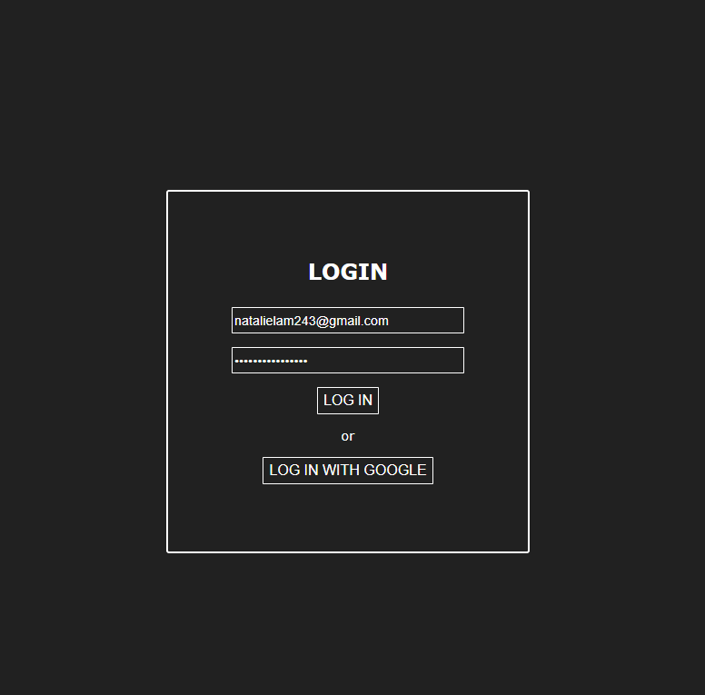
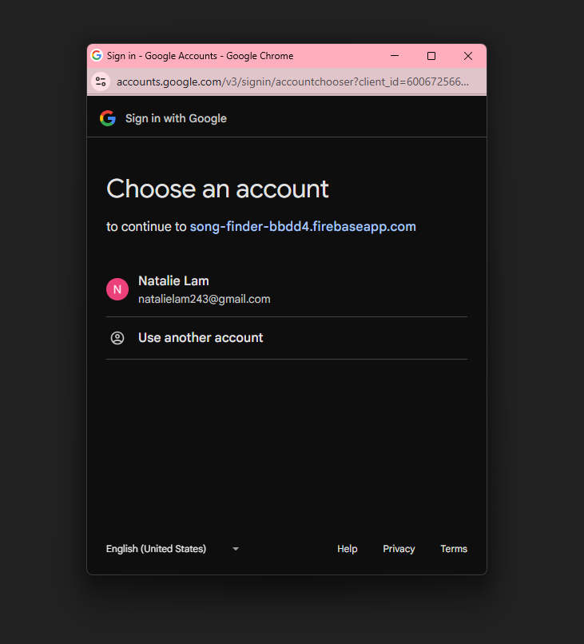
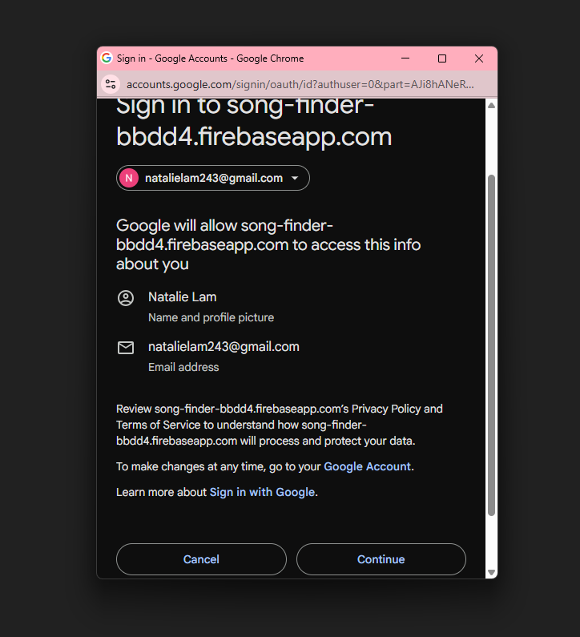
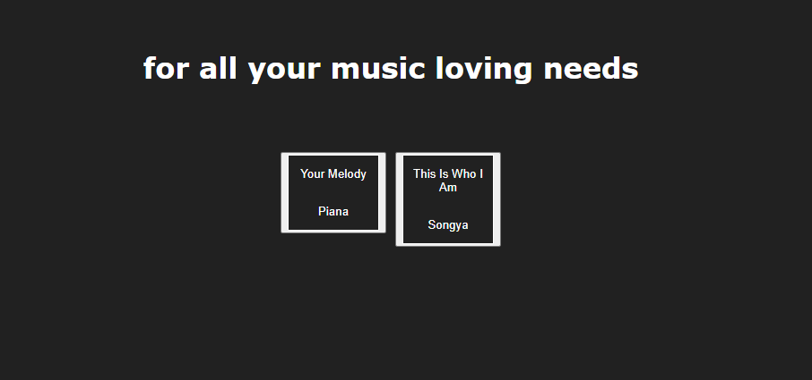
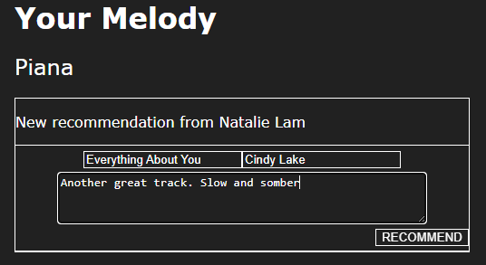
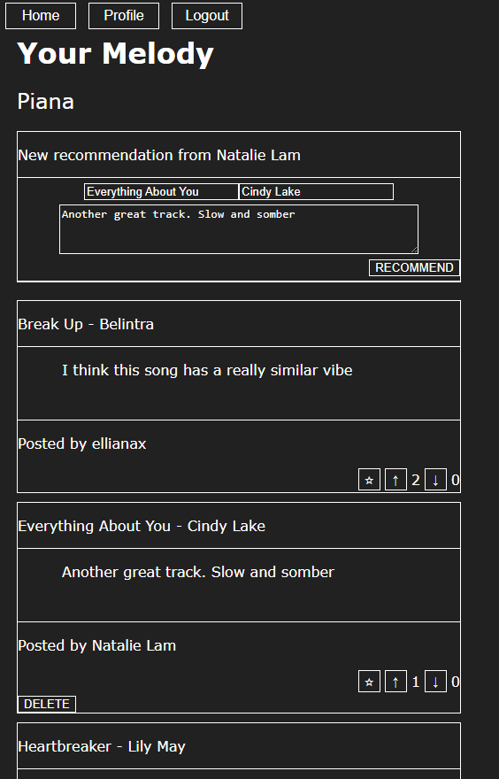
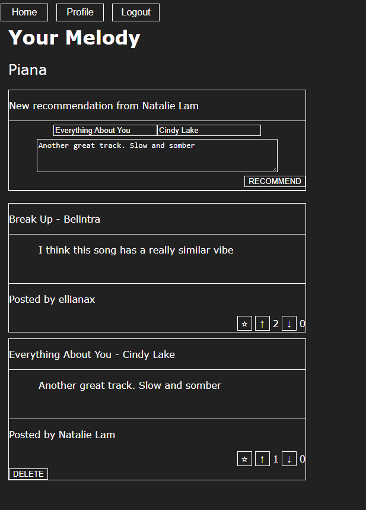
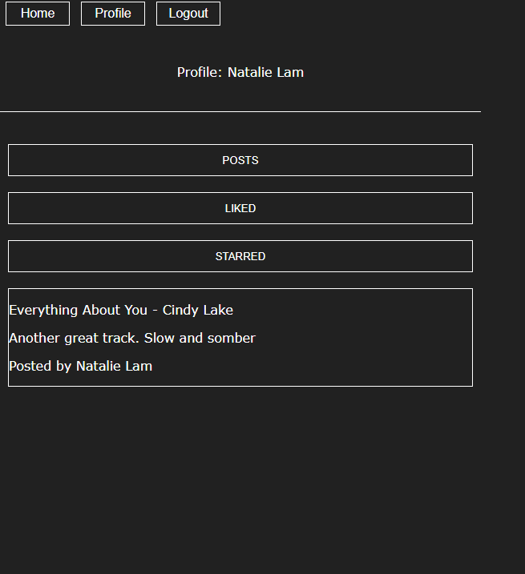
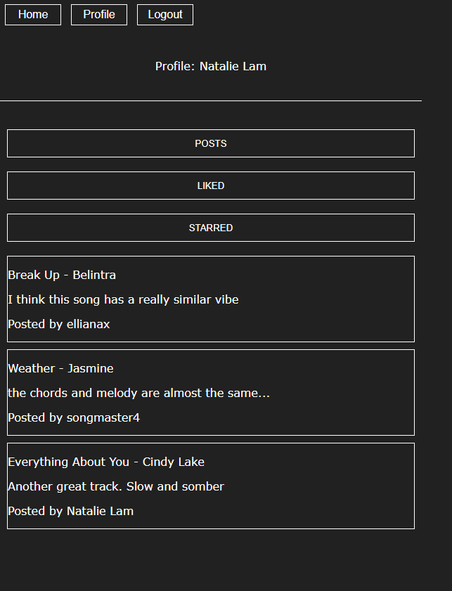
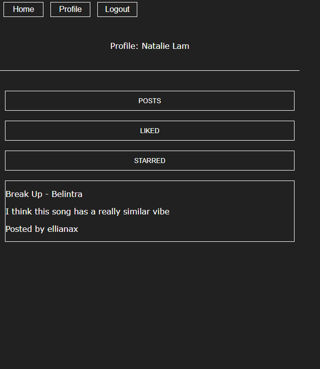

# README

This project was bootstrapped with [Create React App](https://github.com/facebook/create-react-app).

## How to start the app

1. Clone the repository
2. In the project directory, run:

    #### `npm install`

    to download the dependencies
3. Set the `.env` file variables
4. Run: 

    #### `npm start`

    to run the app in the development mode
5. Open [http://localhost:3000](http://localhost:3000) to view it in your browser. The page will reload when you make changes. You may also see any lint errors in the console.

## Features

### Login

You can login with email and password:

or with Google:

### Home page
Here, you can see a catalog of songs uploaded on the site:

When you click on a song, it'll take you to a page filled with similar songs recommended by other users. Let's click on "Your Melody" by Piana.

### Song page
On this page, you can like, dislike, or star other users' song recommendations. The recommendations appear based on the number of likes.

#### Post a song recommendation

Here, you can recommend songs that you think are similar:
  
<b>Before</b>
 

<b>After</b>
 

#### Delete a song recommendation
Of course, you can also delete posts you've created:
  
<b>Before</b>
 

<b>After deleting "Heartbreaker" by Lily May</b>
 

### Profile
On your profile, you can view the songs you've

#### Posted:

#### Liked:

#### Starred:

